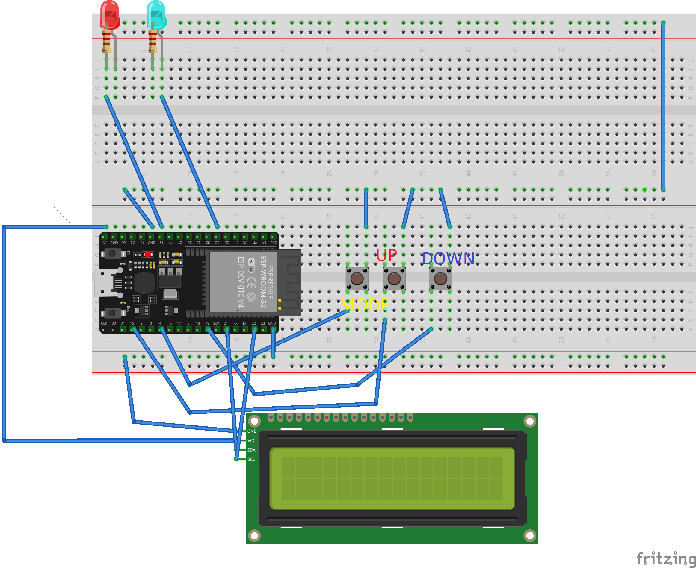

# Venstar ColorTouch Thermostat ESP32 Controller

## Created by Ayman Taleb 12/25/2023


A way to control my Venstar ColorTouch thermostat using my ESP32 over a local network connection. The ColorTouch thermostat is a smart thermostat made by Venstar. It has an app and web interface through their [Skyport Cloud service](https://venstar.com/skyport/). However, I like the idea of having a small device in my room that can control my thermostat. Thankfully, this thermostat has a local API mode. Which means I can just send it HTTP requests to get info and control it. The API is really simple to use if you follow the [documentation](https://developer.venstar.com/). I created the schematic above using [Fritzing](https://fritzing.org/).

### Demo
[See it in action.](https://youtu.be/LQyn5E1adyg) Currently, it is still on a breadboard, but I am in the process of putting it on a perfboard and 3D printing a case for it.


---
### How the API works:
The API uses the [SSDP protocol](https://en.wikipedia.org/wiki/Simple_Service_Discovery_Protocol) to send HTTP requests to the thermostat over your local connection.You can enable HTTPS and use authentication, however, I chose not to. I probably should In order to communication with the thermostat, you must enable local API in the settings on the [device](https://www.youtube.com/watch?v=kB_HcJ3kqCg). Then you just make HTTP requests using what ever API test software, I use [Postman](https://www.postman.com/). I am only using two endpoints, a GET request, to get updates on status/temperature, and a POST request, to send controls to the thermostat. 

#### GET Example:
To get the current info from the thermostat you make this GET request:

``http://192.168.1.100/query/info`` This will not be the IP address of your thermostat, replace it with yours.


And you should get a response similar to this:
```js
{
    name: 'Office',
    mode: 0,
    state: 0,
    activestage: 1,
    fan: 0,
    fanstate: 0,
    tempunits: 0,
    schedule: 0,
    schedulepart: 0,
    away: 0,
    holiday: 0,
    override: 0,
    overridetime: 0,
    forceunocc: 0,
    spacetemp: 79,
    heattemp: 78,
    cooltemp: 75,
    cooltempmin: 35,
    cooltempmax: 99,
    heattempmin: 35,
    heattempmax: 99,
    setpointdelta: 2,
    hum: 50,
    hum_setpoint: 0,
    dehum_setpoint: 99,
    hum_active: 0,
    availablemodes: 0
}
```
The values I used have these definitions:
| VALUE | DEFINITION |
| ----------- | ----------- |
| Mode | Current thermostat mode<br>0: Off<br>1: Heat<br>2: Cool<br>3: Auto |
| State | Current thermostat state<br>0: Idle<br>1: Heating<br>2: Cooling<br>3: Lockout<br>4: Error |
| heattemp | Current heat to temperature|
| cooltemp | Current cool to temperature|


#### Post Example:
To set the mode and temperature you can use this POST request
``http://192.168.1.100/control`` with some additional parameters,
``http://192.168.1.100/control?mode=1&heattemp=75&cooltemp=75``.

This request send a control request to the thermostat telling it to enable heat and set the desired temperature to 75F. 

If it was successful the response will be:

```js
{'success':true}
``` 
If not it will be:

```js
{'error':true}
``` 
### Hardware breakdown
I am using an ESP32 dev board I purchased off of Amazon along with some buttons, LEDs, and an LCD screen that came in an electronics kit I bought. The first of the three buttons are using to change the mode of the thermostat, off, cool, or heat. The second is to increase the temperature and the third is to decrease it. The buttons are connected to pins 4, 15, and 19 respectively. The two LEDs are used to indicate cool or heat, blue or red, pins 12 and 32 respectively. And the LCD screen displays the info from the thermostat, it is connected using I2C. 
